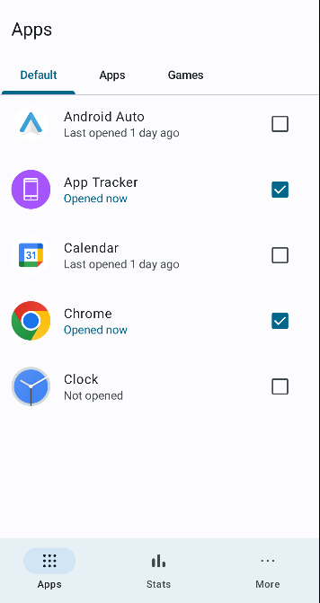

# AppTracker
A lightweight Android app tracker built with Jetpack Compose.

## Screenshots

## Description
AppTracker allows you to select specific apps to track. It then shows if the selected apps have been opened within the day and how long they were used for.

## Features
* See when apps were last opened.
* Create custom categories to categorize tracked apps by.
* Reminder notifications if an app hasn't been opened yet.
* Track app usage time.
* Multiple themes.
* Dark mode & light mode.
* And more...

## Download
The most recent version of the app can be downloaded from the [releases page](https://github.com/Duosion/AppTrackerNative/releases).

## Credits
* Themes provided by the [Tachiyomi](https://github.com/tachiyomiorg/tachiyomi) team.